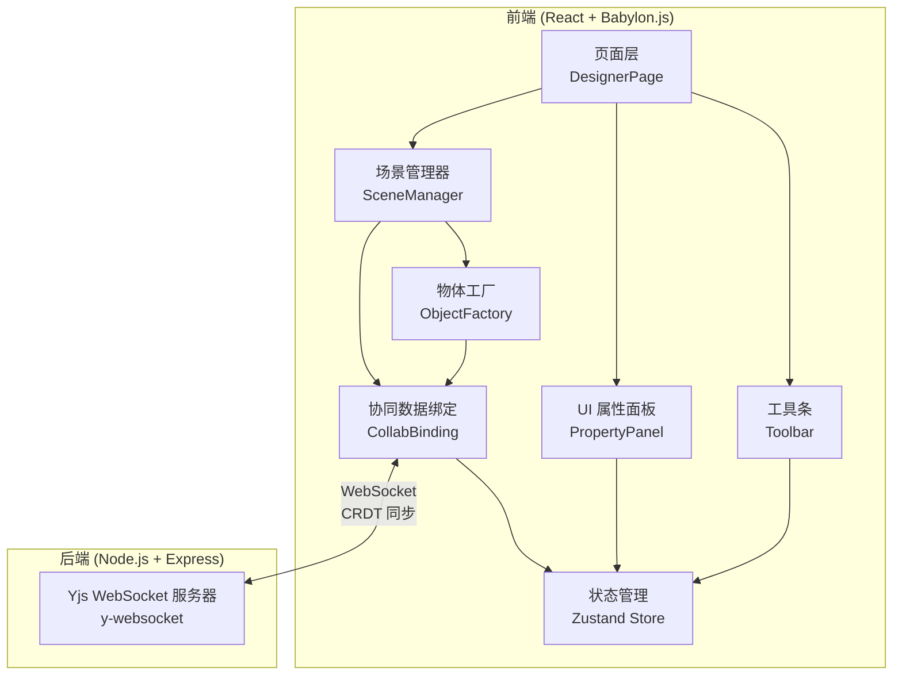
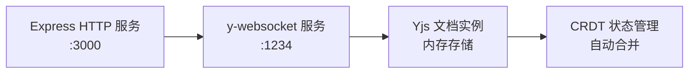
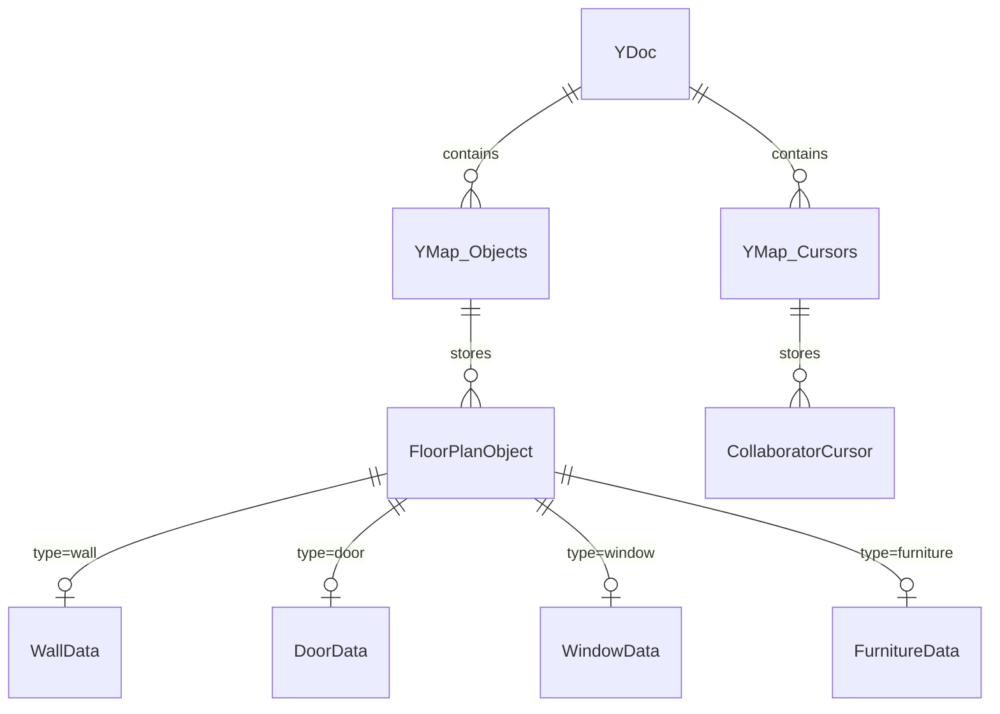

## 1. 架构设计



## 2. 技术说明

- 前端：React@18 + TypeScript + Vite + Tailwind CSS + Babylon.js
- 初始化工具：vite-init (react-express-ts 模板)
- 协同框架：Yjs + y-websocket（CRDT 状态同步）
- 3D/2D 渲染：Babylon.js（正交相机俯视 2D 模式）
- 状态管理：Zustand
- 后端：Express@4 + y-websocket 服务端
- 数据库：无持久化（纯内存 CRDT，可选后续扩展）

## 3. 路由定义

| 路由 | 用途 |
|------|------|
| / | 设计画布主页（房间加入 + 画布编辑） |

## 4. API 定义

### WebSocket 协议

使用 y-websocket 标准协议，房间 URL 格式：`ws://host:1234/room-name`

### 数据结构类型定义

```typescript
interface WallData {
  id: string;
  type: 'wall';
  startX: number;
  startY: number;
  endX: number;
  endY: number;
  thickness: number;
  height: number;
  color: string;
}

interface DoorData {
  id: string;
  type: 'door';
  wallId: string;
  position: number;
  width: number;
  openDirection: 'left' | 'right';
}

interface WindowData {
  id: string;
  type: 'window';
  wallId: string;
  position: number;
  width: number;
  height: number;
  sillHeight: number;
}

interface FurnitureData {
  id: string;
  type: 'furniture';
  subType: 'bed' | 'table' | 'chair' | 'sofa' | 'desk' | 'cabinet' | 'bathtub' | 'toilet' | 'sink' | 'stove';
  x: number;
  y: number;
  width: number;
  depth: number;
  rotation: number;
  color: string;
}

type FloorPlanObject = WallData | DoorData | WindowData | FurnitureData;

interface CollaboratorCursor {
  userId: string;
  name: string;
  color: string;
  x: number;
  y: number;
}

interface YjsDocumentStructure {
  objects: Y.Map<FloorPlanObject>;
  cursors: Y.Map<CollaboratorCursor>;
}
```

## 5. 服务器架构



后端仅作为 y-websocket 中继服务器，负责：
- 管理房间（Yjs 文档实例）
- 广播 CRDT 更新至所有连接的客户端
- 不做业务逻辑处理（CRDT 自行解决冲突）

## 6. 前端模块架构

### 6.1 模块依赖关系

```mermaid
graph TD
    "SceneManager" --> "ObjectFactory"
    "SceneManager" --> "CollabBinding"
    "ObjectFactory" --> "CollabBinding"
    "CollabBinding" --> "Yjs Doc"
    "PropertyPanel" --> "Zustand Store"
    "Toolbar" --> "Zustand Store"
    "SceneManager" --> "Zustand Store"
    "Yjs Doc" <-->|"WebSocket"| "y-websocket Server"
```

### 6.2 模块职责

| 模块 | 文件 | 职责 |
|------|------|------|
| 场景管理器 | src/core/SceneManager.ts | Babylon.js 引擎初始化、正交相机、网格渲染、物体选中和变换 |
| 物体工厂 | src/core/ObjectFactory.ts | 创建墙体/门窗/家具的 Babylon.js Mesh，处理组件库定义 |
| 协同数据绑定 | src/core/CollabBinding.ts | Yjs 文档初始化、y-websocket 连接、CRDT 事件监听与场景同步 |
| UI 属性面板 | src/components/PropertyPanel.tsx | 选中物体的属性编辑表单，双向绑定 Yjs 数据 |
| 工具条 | src/components/Toolbar.tsx | 工具选择、组件拖拽源、撤销/重做操作 |
| 状态管理 | src/stores/useDesignerStore.ts | Zustand store：当前工具、选中物体、协作者列表、连接状态 |

## 7. 数据模型

### 7.1 Yjs CRDT 数据结构



### 7.2 数据定义

Yjs 文档使用 `Y.Map` 嵌套结构：

```
Y.Doc
  ├── objects: Y.Map<string, FloorPlanObject>   // key=objectId
  └── cursors: Y.Map<string, CollaboratorCursor> // key=userId
```

所有物体数据以 JSON 对象形式存储在 Y.Map 中，利用 Yjs 的 CRDT 特性自动解决并发冲突。
